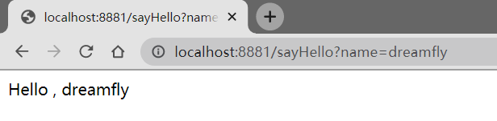

# SpringBoot-Dubbo
SpringBoot 整合Dubbo 入门案例

运行步骤：
1. 安装Zookeeper
2. 在Zookeeper安装目录bin目录下的运行zkServer.cmd
2. 启动springboot_dubbo_server
3. 启动springboot_dubbo_client
4. 在浏览器中访问 http://localhost:8881/sayHello?name=dreamfly

运行结果：

参考：
[SpringBoot整合dubbo](https://juejin.im/post/5b21d6696fb9a01e4e5e6e63)

